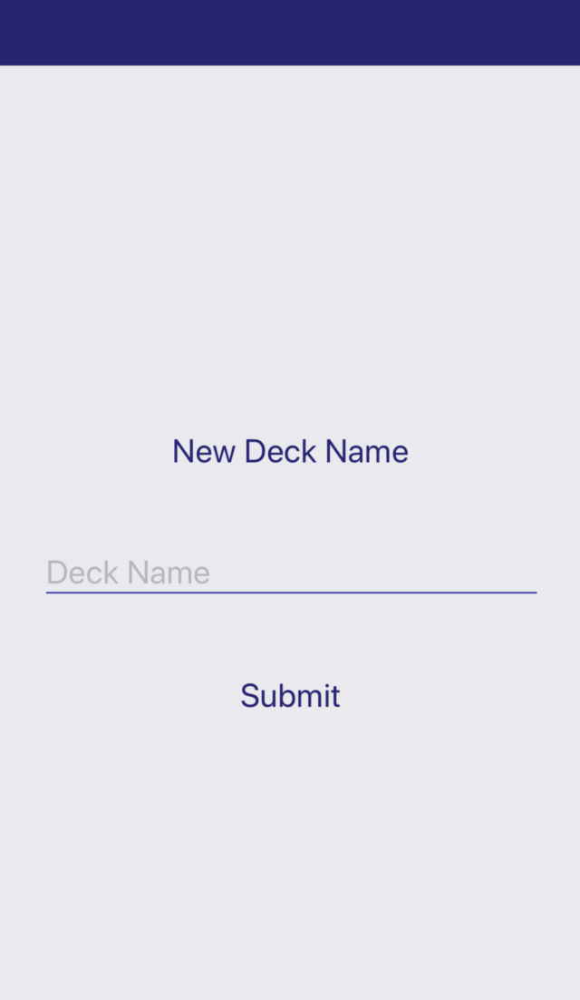
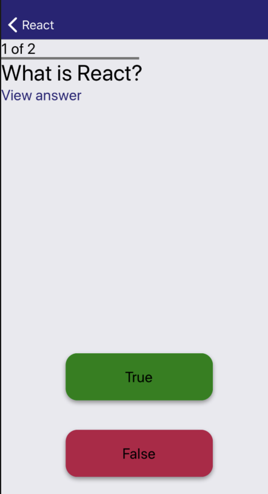

# MobileFlashCards Project

MobileFlashCards Project is a mobile application that allows users to study collections of flashcards

# App Screenshot

## Decks 

## New Deck 

## Deck View

## Quiz View

# App Functionalty

Users will be able to
1. create different categories of flashcards called "decks"
2. add flashcards to those decks
3. take quizzes on those deck

# Installation Instructions

* git clone https://github.com/mavisluan/mobile-flashcards.git
* cd mobile-flashcards
* yarn install
* yarn start
