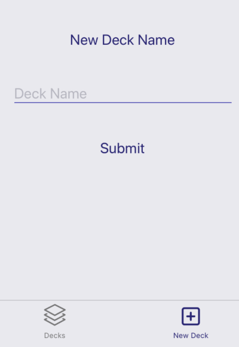

# MobileFlashCards Project

- MobileFlashCards Project is a mobile application, build with ReactJS. 
- It allows users to study collections of flashcards

# App Screenshot

## Decks 

## New Deck 

## Deck View

## Quiz View

# App Functionalty

Users will be able to
- create different categories of flashcards called "decks"
- add flashcards to those decks
- take quizzes on those deck

# Installation Instructions

- git clone https://github.com/mavisluan/mobile-flashcards.git
- cd mobile-flashcards
- yarn install
- yarn start
